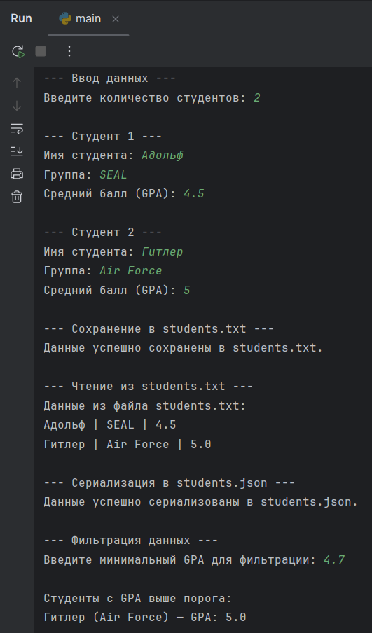

# 📘Oчет по Лабораторной работе №10

**Тема:** Программирование ввода-вывода. Работа с файлами и сериализация данных.

## 1. Цель и краткое описание задания

### Цель работы

Освоить методы работы с файлами (чтение, запись) и научиться использовать механизмы сериализации данных (сохранение сложных структур, таких как списки словарей, в форматы TXT и JSON) в Python.

### Описание задания

Программа реализует ввод данных о студентах (Имя, Группа, GPA), сохраняет их в текстовый файл (students.txt) и сериализует в формат JSON (students.json). Также реализовано чтение данных из TXT-файла и их фильтрация по заданному минимальному GPA. В код добавлены элементы усложнения: обработка ошибок ввода (try/except) и сортировка отфильтрованного списка.

---

## 2. Исходный код программы (main.py)
```python
import json

# --- Инициализация данных ---
students = []

# --- Ввод данных пользователем ---
print("--- Ввод данных ---")
try:
    n = int(input("Введите количество студентов: "))
except ValueError:
    print("Ошибка: Введено неверное количество студентов. Установлено 0.")
    n = 0

for i in range(n):
    print(f"\n--- Студент {i+1} ---")
    name = input("Имя студента: ")
    group = input("Группа: ")
    
    gpa_valid = False
    while not gpa_valid:
        try:
            gpa = float(input("Средний балл (GPA): "))
            if 0.0 <= gpa <= 5.0:
                gpa_valid = True
            else:
                print("GPA должен быть в диапазоне от 0.0 до 5.0")
        except ValueError:
            print("Ошибка: Введите GPA как число (например, 3.75).")
            
    # Добавляем данные в список
    students.append({"name": name, "group": group, "gpa": gpa})

# --- Сохранение в текстовый файл (students.txt) ---
print("\n--- Сохранение в students.txt ---")
try:
    with open("students.txt", "w", encoding="utf-8") as f:
        for s in students:
            f.write(f"{s['name']} | {s['group']} | {s['gpa']}\n")
    print("Данные успешно сохранены в students.txt.")
except IOError:
    print("Ошибка: Не удалось записать данные в students.txt.")

# --- Чтение и вывод данных из students.txt ---
print("\n--- Чтение из students.txt ---")
try:
    with open("students.txt", "r", encoding="utf-8") as f:
        print("Данные из файла students.txt:")
        for line in f:
            print(line.strip())
except FileNotFoundError:
    print("Ошибка: Файл students.txt не найден.")

# --- Сериализация в JSON (students.json) ---
print("\n--- Сериализация в students.json ---")
try:
    with open("students.json", "w", encoding="utf-8") as jf:
        json.dump(students, jf, ensure_ascii=False, indent=4) 
    print("Данные успешно сериализованы в students.json.")
except IOError:
    print("Ошибка: Не удалось записать данные в students.json.")

# --- Фильтрация по GPA ---
print("\n--- Фильтрация данных ---")
if students:
    try:
        threshold = float(input("Введите минимальный GPA для фильтрации: "))
        
        filtered = [s for s in students if s["gpa"] >= threshold]

        print("\nСтуденты с GPA выше порога:")
        if filtered:
            filtered.sort(key=lambda s: s['gpa'], reverse=True)
            for s in filtered:
                print(f"{s['name']} ({s['group']}) — GPA: {s['gpa']}")
        else:
            print("Студентов, соответствующих порогу, не найдено.")
            
    except ValueError:
        print("Ошибка фильтрации: Введите порог GPA как число.")
else:
    print("Список студентов пуст, фильтрация невозможна.")
```

---

## 3. Скриншоты работы программы



## 4. Пример содержимого файлов

### students.txt
```
Адольф | SEAL | 4.5
Гитлер | Air Force | 5.0
```

### students.json
```
[
    {
        "name": "Адольф",
        "group": "SEAL",
        "gpa": 4.5
    },
    {
        "name": "Гитлер",
        "group": "Air Force",
        "gpa": 5.0
    }
]
```

---

## 5. Вывод по результатам выполнения

### В результате выполнения лабораторной работы были изучены и применены следующие ключевые навыки:

1. Работа с файлами: Освоены функции открытия файла (open), режимы ("w" для записи, "r" для чтения) и запись/чтение данных с использованием контекстного менеджера with open(...) для безопасного закрытия файла.
2. Сериализация данных: Изучена библиотека json и реализована сериализация (преобразование списка Python-словарей в строку JSON) с помощью функции json.dump() для структурированного сохранения данных.  
3. Обработка ошибок: Добавлена конструкция try/except для повышения устойчивости программы к некорректному вводу данных пользователем (ValueError) и ошибкам ввода-вывода (IOError).
4. Ввод-вывод: Реализован полный цикл ввода данных (с консоли), их обработки (фильтрация, сортировка) и вывода (в консоль и в файлы)