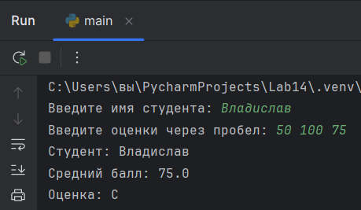
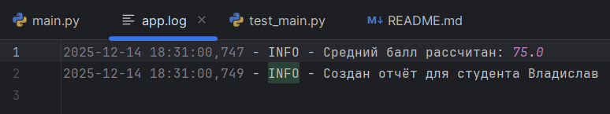

# Лабораторная работа №14
## Тема: Тестирование и отладка программных средств
## Абдыкапаров Даниял ИС 24-22

### Цель работы
Освоить применение unit-тестирования и логирования для контроля корректности работы программ.

### Ход выполнения
1. Реализованы функции для расчёта среднего балла (calculate_average) и определения оценки (determine_grade_letter).
2. Добавлено логирование ошибок и событий в файл app.log.
3. Написаны unit-тесты в test_main.py.
4. Все тесты пройдены успешно.

### Исходный основной код
``` python
import logging

# 4. Настройка логирования событий в файл app.log
logging.basicConfig(filename='app.log', level=logging.INFO,
                    format='%(asctime)s - %(levelname)s - %(message)s',
                    encoding='utf-8')

def calculate_average(grades):
    """Вычисляет средний балл с обработкой ошибок и логированием"""
    # Логирование ошибки: пустой список
    if not grades:
        logging.error("Список оценок пуст")
        raise ValueError("Список оценок не может быть пустым")

    # Логирование ошибки: некорректный тип данных
    if not all(isinstance(x, (int, float)) for x in grades):
        logging.error("Некорректный тип данных в списке")
        raise TypeError("Все оценки должны быть числами")

    avg = sum(grades) / len(grades)
    # Логирование события: успешный расчёт
    logging.info(f"Средний балл рассчитан: {avg}")
    return round(avg, 2)


def determine_grade_letter(avg):
    """Определяет буквенную оценку по шкале (A, B, C, D, F)"""
    if avg >= 90:
        return "A"
    elif avg >= 80:
        return "B"
    elif avg >= 70:
        return "C"
    elif avg >= 60:
        return "D"
    else:
        return "F"


def student_report(name, grades):
    """Формирует итоговый отчёт"""
    avg = calculate_average(grades)
    letter = determine_grade_letter(avg)
    result = f"Студент: {name}\nСредний балл: {avg}\nОценка: {letter}"
    # Логирование события: создание отчёта
    logging.info(f"Создан отчёт для студента {name}")
    return result


if __name__ == "__main__":
    try:
        name = input("Введите имя студента: ")
        grades_input = input("Введите оценки через пробел: ")
        # Преобразование введенных строк в числа с плавающей точкой
        grades = [float(x) for x in grades_input.split()]
        print(student_report(name, grades))
    except Exception as e:
        print("Ошибка:", e)
        # Логирование исключения
        logging.exception("Произошло исключение")

import logging
```

### Исходный тестовый код
``` python
import unittest
# Импортируем функции для тестирования
from main import calculate_average, determine_grade_letter, student_report


# 5. Написать unit-тесты
class TestGrades(unittest.TestCase):
    """Класс для Unit-тестирования функций расчёта оценок"""

    # Тестирование расчёта среднего балла
    def test_average_calculation(self):
        # Проверка обычного случая
        self.assertEqual(calculate_average([90, 80, 100]), 90.0)
        # Проверка с десятичными дробями
        self.assertEqual(calculate_average([95.5, 85]), 90.25)

    # Тестирование обработки пустого списка (ValueError)
    def test_average_empty(self):
        with self.assertRaises(ValueError):
            calculate_average([])

    # Тестирование обработки некорректного типа данных (TypeError)
    def test_average_type_error(self):
        with self.assertRaises(TypeError):
            calculate_average([90, "80", 70])

    # Тестирование определения буквенной оценки
    def test_letter_grade(self):
        self.assertEqual(determine_grade_letter(95), "A")
        self.assertEqual(determine_grade_letter(82), "B")
        self.assertEqual(determine_grade_letter(75), "C")
        self.assertEqual(determine_grade_letter(65), "D")
        self.assertEqual(determine_grade_letter(40), "F")

    # Тестирование функции формирования отчёта (Интеграционный тест)
    def test_student_report(self):
        result = student_report("Алиса", [100, 90, 80])
        # Проверяем, что в отчёте содержатся имя, метка среднего балла и итоговая оценка
        self.assertIn("Алиса", result)
        self.assertIn("Средний балл", result)
        self.assertIn("A", result)


if __name__ == "__main__":
    unittest.main()
```

### Пример запуска тестов
`shell
python -m unittest test_main.py
...
Ran 1 test in 0.005s

OK

import unittest
# Импортируем функции для тестирования
from main import calculate_average, determine_grade_letter, student_report


# 5. Написать unit-тесты
class TestGrades(unittest.TestCase):
    """Класс для Unit-тестирования функций расчёта оценок"""

    # Тестирование расчёта среднего балла
    def test_average_calculation(self):
        # Проверка обычного случая
        self.assertEqual(calculate_average([90, 80, 100]), 90.0)
        # Проверка с десятичными дробями
        self.assertEqual(calculate_average([95.5, 85]), 90.25)

    # Тестирование обработки пустого списка (ValueError)
    def test_average_empty(self):
        with self.assertRaises(ValueError):
            calculate_average([])

    # Тестирование обработки некорректного типа данных (TypeError)
    def test_average_type_error(self):
        with self.assertRaises(TypeError):
            calculate_average([90, "80", 70])

    # Тестирование определения буквенной оценки
    def test_letter_grade(self):
        self.assertEqual(determine_grade_letter(95), "A")
        self.assertEqual(determine_grade_letter(82), "B")
        self.assertEqual(determine_grade_letter(75), "C")
        self.assertEqual(determine_grade_letter(65), "D")
        self.assertEqual(determine_grade_letter(40), "F")

    # Тестирование функции формирования отчёта (Интеграционный тест)
    def test_student_report(self):
        result = student_report("Алиса", [100, 90, 80])
        # Проверяем, что в отчёте содержатся имя, метка среднего балла и итоговая оценка
        self.assertIn("Алиса", result)
        self.assertIn("Средний балл", result)
        self.assertIn("A", result)


if __name__ == "__main__":
    unittest.main() Пример работы программы


### Пример содержимого app.log


### Вывод
В ходе лабораторной работы изучены принципы тестирования и отладки. Получены практические навыки использования unittest и logging для обеспечения надёжности программ.