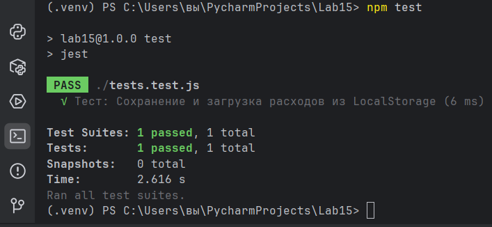
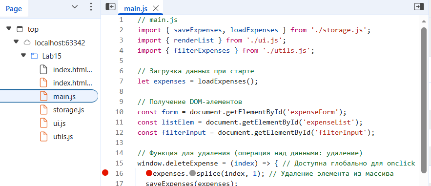

# 💸 Лабораторная №15: Менеджер Расходов

## 1. Цель работы
Закрепление навыков работы с модульностью JavaScript, структурами данных (Array), обработкой событий, сохранением данных в браузере (LocalStorage), а также освоение основ Unit-тестирования (Jest) и отладки кода.

## 2. Структура проекта
Проект реализован с использованием модульного подхода (ES-модули) для разделения логики (main.js), работы с DOM (ui.js), хранением данных (storage.js) и вспомогательными функциями (utils.js).

Lab15/
├── index.html
├── main.js
├── storage.js
├── ui.js
├── utils.js
├── tests.test.js
├── package.json
└── README.md

## 3. Выполнение обязательных требований

| Требование | Статус | Комментарий |
| :--- | :--- | :--- |
| Модульность | ✅ Выполнено | Использовано 4 модуля (main, storage, ui, utils). |
| Структура данных | ✅ Выполнено | Список расходов хранится в массиве объектов (Array). |
| LocalStorage | ✅ Выполнено | Данные сохраняются и загружаются через storage.js. |
| Unit-тест | ✅ Выполнено | Тест проверяет корректность сохранения/загрузки данных. |
| Отладка | ✅ Выполнено | Проведена отладка с использованием breakpoint в функции удаления расхода. |

## 4. Результаты Unit-тестирования

* Инструмент: Jest
* Результат: Тест успешно пройден.

 

## 5. Скриншоты работы приложения

* Рабочий интерфейс:

* Отладка (Breakpoint):
    

## 6. Выводы по работе

В ходе выполнения лабораторной работы были закреплены навыки по организации кода с помощью ES-модулей, корректному взаимодействию с DOM, а также реализации надежного хранения данных с использованием JSON и LocalStorage. Была освоена настройка среды для Unit-тестирования с помощью Jest.