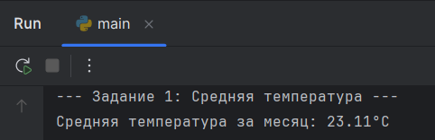
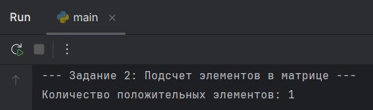

# 📚 Отчет по Лабораторной работе №6: Обработка данных

---

## 1. Цель работы

Целью работы является демонстрация навыков обработки данных в Python, включая:
* Вычисление базовых статистических показателей (среднее значение).
* Работа с многомерными структурами данных (матрицами) и применение сложных условий фильтрации.

---

## 2. Исходный код программы

```python
# --- ЗАДАНИЕ 1: ВЫЧИСЛЕНИЕ СРЕДНЕГО ЗНАЧЕНИЯ ---
print("--- Задание 1: Средняя температура ---")
temps = [20.5, 21.0, 19.8, 22.3, 23.1, 24.0, 25.2, 26.5, 27.1, 28.0,
         29.3, 30.1, 28.7, 27.5, 26.8, 25.9, 24.4, 23.6, 22.7, 21.8,
         20.9, 19.5, 18.7, 17.8, 16.9, 18.2, 19.3, 20.1, 21.5, 22.0]

average_temp = sum(temps) / len(temps)
print(f"Средняя температура за месяц: {average_temp:.2f}°C")
print("-" * 50)

# --- ЗАДАНИЕ 2: ПОДСЧЕТ ЭЛЕМЕНТОВ В МАТРИЦЕ ---
print("--- Задание 2: Подсчет элементов в матрице ---")
B = [
    [1, -2, 3, 4, -5],
    [-1, 6, -7, 8, 9],
    [10, -11, 12, -13, 14],
    [-15, 16, 17, -18, 19],
    [20, -21, 22, 23, -24]
]

count = 0
matrix_size = 5

for i in range(matrix_size): 
    for j in range(matrix_size):
        # Условие: выше главной диагонали (j > i) И в первых трех столбцах (j < 3)
        if j > i and j < 3:
            if B[i][j] > 0:
                count += 1

print("Количество положительных элементов:", count)
print("-" * 50)
```

---

## 3. Скриншоты и результаты



---



---

## 4. Выводы по результатам работы
### В ходе выполнения лабораторной работы были успешно применены:
1. Вычислительные навыки: Продемонстрировано использование встроенных функций sum() и len() для эффективного вычисления статистических показателей.
2. Работа с матрицами: Освоены навыки итерации по двумерным массивам (матрицам) с использованием вложенных циклов.
3. Логическая фильтрация: Реализованы сложные логические условия (if j > i and j < 3:) для фильтрации элементов матрицы по их позиции (индексам), а также по значению (положительный элемент).
