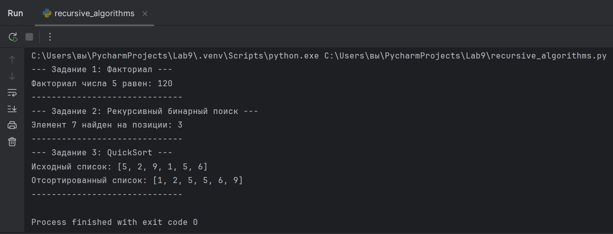

# 🧪 Лабораторная работа №9: Реализация рекурсивных алгоритмов
Дисциплина: Языки и технология программирования
Студент: Рашидинов Дамир

---

## 🎯 1. Цель и Задачи Работы

### Цель
Закрепить навыки применения рекурсии в решении вычислительных задач, а также освоить методы реализации алгоритмов поиска и сортировки с использованием рекурсивных подходов.

### Задачи
1.  Изучить принципы работы рекурсии.
2.  Реализовать рекурсивные алгоритмы сортировки (QuickSort, MergeSort).
3.  Реализовать рекурсивный алгоритм поиска элемента (Бинарный поиск).
4.  Исследовать эффективность и глубину рекурсии.

---

## 📘 2. Теоретические сведения

Рекурсия — это способ организации вычислений, при котором функция вызывает саму себя.

### Ключевые принципы рекурсии:
* Наличие базового (остановочного) условия (точки выхода).
* Уменьшение задачи на каждом шаге, что гарантирует достижение базового условия.

Каждый рекурсивный вызов порождает новый контекст выполнения (стек вызовов).

---

## 💻 3. Реализация и Результаты

Исходный код находится в файле recursive_algorithms.py.

### Задание 1: Простая рекурсия (Вычисление факториала)

Задание: Написать рекурсивную функцию для вычисления $n!$.

#### Исходный код:
```python
def factorial(n):
    if n == 0 or n == 1:
        return 1
    else:
        return n * factorial(n - 1)
```
#### Результат:
```
--- Задание 1: Факториал ---
Факториал числа 5 равен: 120
```
### Задание 2: Рекурсивный поиск (Бинарный поиск)

Задание: Реализовать рекурсивный алгоритм бинарного поиска элемента в отсортированном списке.

#### Исходный код:
```python
def binary_search(arr, left, right, x):
    if right >= left:
        mid = left + (right - left) // 2
        if arr[mid] == x:
            return mid
        elif arr[mid] > x:
            return binary_search(arr, left, mid - 1, x)
        else:
            return binary_search(arr, mid + 1, right, x)
    else:
        return -1
```
#### Результат:
```
--- Задание 2: Рекурсивный бинарный поиск ---
Элемент 7 найден на позиции: 3
```

### Задание 3: Рекурсивная сортировка (QuickSort)

Задание: Реализовать алгоритм быстрой сортировки (QuickSort) с помощью рекурсии.

#### Исходный код:
```python
def quicksort(arr):
    if len(arr) <= 1:
        return arr
    pivot = arr[len(arr)//2]
    left = [x for x in arr if x < pivot]
    middle = [x for x in arr if x == pivot]
    right = [x for x in arr if x > pivot]
    return quicksort(left) + middle + quicksort(right)
```
#### Результат:
```
--- Задание 3: QuickSort ---
Исходный список: [5, 2, 9, 1, 5, 6]
Отсортированный список: [1, 2, 5, 5, 6, 9]
```

---

## 💡4. Выводы по результатам исследования

В ходе лабораторной работы были закреплены навыки работы с рекурсивными алгоритмами.

1. Понятие рекурсии и ее принципы были изучены и применены: в каждой функции присутствовало базовое условие и реализован шаг уменьшения задачи.  
2. Успешно реализованы рекурсивные алгоритмы для вычисления (факториал), поиска (бинарный поиск) и сортировки (QuickSort).  
3. Рекурсивные алгоритмы, такие как QuickSort и бинарный поиск, показали свою эффективность при разделении задачи на более мелкие подзадачи.
4. Было отмечено, что неэффективность рекурсии может возникнуть из-за накладных расходов на стек вызовов и потенциального риска переполнения стека при слишком большой глубине рекурсии, что является ключевым отличием от итерационных алгоритмов. Для оптимизации можно использовать мемоизацию или хвостовую рекурсию.

---

